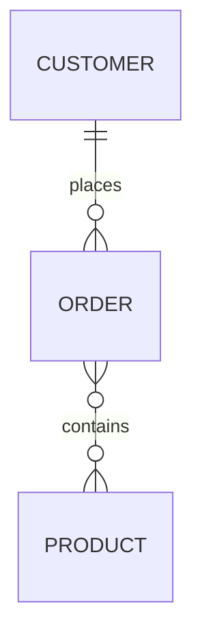

# Export Format Examples

This folder contains example exports from `dbt-conceptual` in all supported formats.

## Files

### 1. **example.mmd** (Mermaid)
- **Format**: Text-based diagram syntax
- **Use case**: Embed in Markdown files, GitHub README, documentation
- **Viewable**: GitHub renders Mermaid diagrams natively in markdown
- **Editable**: Yes, plain text



### 2. **example.excalidraw** (Excalidraw)
- **Format**: JSON diagram definition
- **Use case**: Editable whiteboard-style diagrams
- **Viewable**: Open at https://excalidraw.com (File → Open)
- **Editable**: Yes, full visual editing
- **Features**: Hand-drawn style, annotations, collaboration

### 3. **example.png** (PNG Image)
- **Format**: Static raster image (1200×800)
- **Use case**: Presentations, documentation, Slack/email
- **Viewable**: Any image viewer
- **Editable**: No
- **Features**: Clean layout with domain groupings, concept boxes, relationship arrows

### 4. **coverage.html** (Coverage Dashboard)
- **Format**: Self-contained HTML dashboard
- **Use case**: View implementation coverage by domain and layer
- **Viewable**: Open in web browser
- **Editable**: No
- **Features**: Shows which concepts have implementing models in Silver/Gold layers

### 5. **bus-matrix.html** (Kimball Bus Matrix)
- **Format**: Self-contained HTML matrix
- **Use case**: Dimensional modeling conformity analysis
- **Viewable**: Open in web browser
- **Editable**: No
- **Features**: Shows which dimensions are used by which facts (Kimball methodology)

## How These Were Generated

All exports were generated from the sample conceptual model in `.claude/sample-project/`:

```bash
# Mermaid
dbt-conceptual export --format mermaid -o example.mmd

# Excalidraw
dbt-conceptual export --format excalidraw -o example.excalidraw

# PNG
dbt-conceptual export --format png -o example.png

# Coverage Dashboard
dbt-conceptual export --format coverage -o coverage.html

# Bus Matrix
dbt-conceptual export --format bus-matrix -o bus-matrix.html
```

## Which Format Should I Use?

| Use Case | Best Format |
|----------|-------------|
| GitHub README or docs | Mermaid (`.mmd`) |
| Collaborative design sessions | Excalidraw (`.excalidraw`) |
| Presentations or slides | PNG (`.png`) |
| Track implementation progress | Coverage Dashboard (`.html`) |
| Validate dimensional conformity | Bus Matrix (`.html`) |
| Quick sharing (Slack, email) | PNG (`.png`) |

## Sample Conceptual Model

The examples use this simple e-commerce model:

- **Domains**: Party, Transaction, Catalog
- **Concepts**: Customer, Order, Product, Shipment
- **Relationships**:
  - Customer → places → Order (1:N)
  - Order → contains → Product (N:M)
