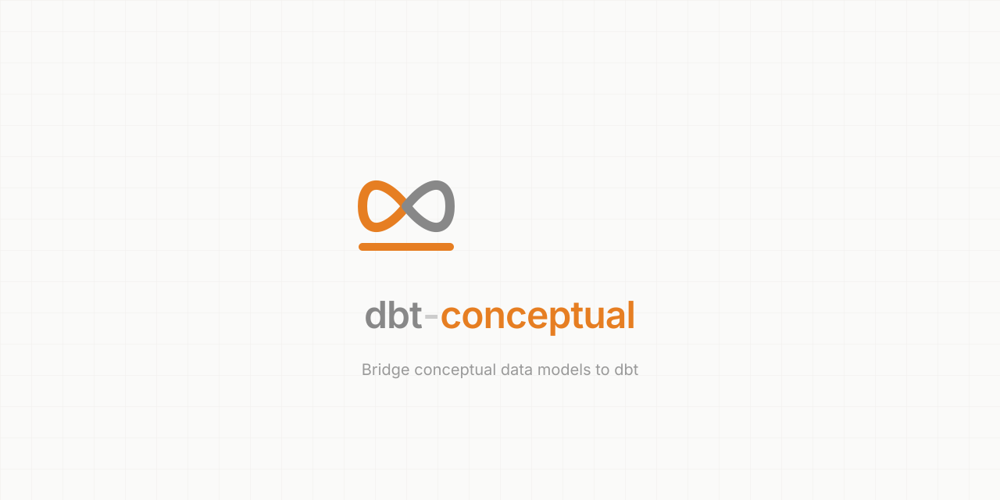
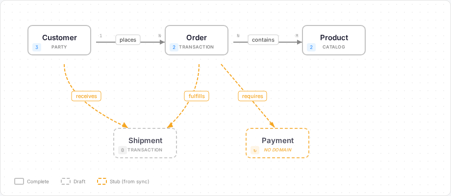
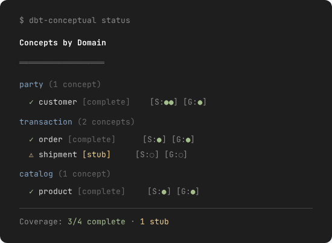
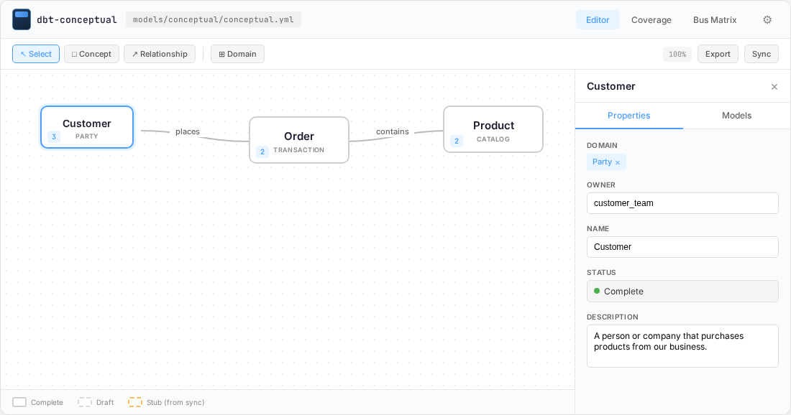
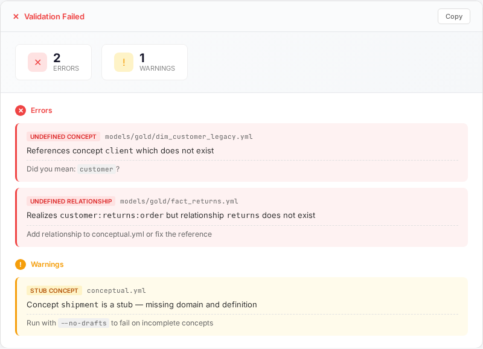
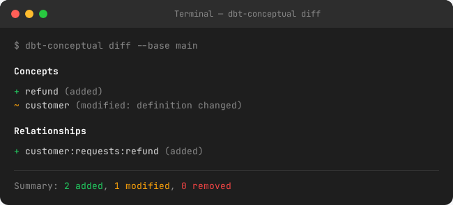
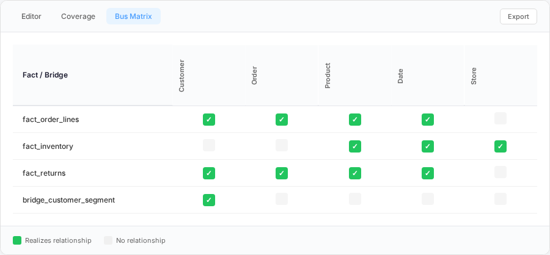

<p align="center">
  
</p>

> *Conceptual modeling without the ceremony. Shared vocabulary for data teams who don't have time for meetings.*
>
> *If you've ever taken a photo of the whiteboard after a meeting to capture the model — this is for you.*

[](https://pypi.org/project/dbt-conceptual/)
[](https://pypi.org/project/dbt-conceptual/)
[](https://opensource.org/licenses/MIT)
[](https://github.com/dbt-conceptual/dbt-conceptual/actions/workflows/ci.yml)
[](https://codecov.io/gh/dbt-conceptual/dbt-conceptual)
[](https://dbt-conceptual.gitbook.io/dbt-conceptual-docs/)

---

## The Problem

### What Died

The data architect would sit down with business stakeholders and SMEs, sketch boxes and lines on a whiteboard until everyone nodded. That whiteboard became a conceptual model in Erwin or PowerDesigner. From there, a logical model — normalized, pristine. From the logical, a physical model. Then down to the engineers: "We're building this."

Business would come back: "We need more." Back to the whiteboard. Back to the ivory tower. Update the conceptual, refresh the logical, derive an updated physical. Back to the engineers: "We're changing this, adding that."

Repeat ad infinitum. Or at least, repeat quarterly — because that's how fast this process could move.

It worked when releases shipped quarterly. It worked when teams were co-located. It worked when the data architect owned the timeline. Then it stopped working.

### What Replaced It

Engineer autonomy. dbt democratized transformation. Teams ship daily. The architect who says "wait for the model" gets routed around. No gatekeepers, no handoffs, no time for the ivory tower round-trip.

### What That Created

The whiteboard session on day one is now the last moment of shared understanding. After that:

- Models proliferate without coherence
- Naming conventions drift
- Concepts duplicate across teams
- Tribal knowledge calcifies
- Nobody knows what "customer" means anymore

The conceptual→logical→physical cascade is gone. But nothing replaced the *thinking* it forced. We kept the speed, lost the shared vocabulary.

---

## The Solution

The boxes on the whiteboard were never the problem. They still work. They still create shared understanding in five minutes.

The problem was everything *after* the boxes — the cascade into logical models, physical models, DDL generation, change management. That couldn't keep pace.

**dbt-conceptual stops at the boxes. But connects them to reality.**

- Define concepts and relationships in YAML
- Tag dbt models with `meta.concept`
- See which concepts are implemented, which are missing
- Surface new concepts in CI/CD: *"This PR introduces `Refund` — no definition yet"*

No logical model. No physical derivation. Just shared vocabulary that lives with the code.

<!-- ASSET: docs/assets/canvas-example.png — Canvas showing concepts with relationships, complete/draft/stub states, and legend -->


---

> *"Just enough architecture to stay sane."*
>
> *"The Stoic's choice for conceptual modeling in the modern world."*
>
> *"Architecture that ships with the code."*

---

## Who This Is For

**For architects who write code and engineers who think in systems.**

- The player-coach who advises without blocking
- The senior engineer everyone asks "what does this table mean?"
- The data lead who notices drift before it compounds

If you've ever drawn boxes on a whiteboard and wished they stayed current — this is for you.

---

## What This Isn't

- **Not an enterprise data catalog** — feeds Collibra/Purview/Alation, doesn't replace them
- **Not a deployment gate** — surfaces information, doesn't block PRs
- **Not Erwin-in-git** — no logical models, no DDL generation, no attribute-level detail
- **Not self-sustaining** — requires someone to care about shared vocabulary

If nobody owns the conceptual model, this tool won't fix that. That's an org problem, not a tooling problem.

---

## ⚠️ Opinionated by Design

This tool assumes:

- **dbt** as your transformation layer
- **Medallion architecture** — Silver → Gold (Bronze inferred from lineage)
- **Dimensional modeling** in Gold — dims, facts, bridges

If that's your stack, this fits naturally. If not, no judgment — just not the target use case.

**What's flexible:**

- Folder paths are configurable (`models/staging` → silver, `models/marts` → gold)
- Single or shared `schema.yml` files
- Your existing dbt organizational patterns (groups, tags, etc.)

---

## Installation

```bash
# No signup. No telemetry. No "please star this repo" popups.
pip install dbt-conceptual
```

---

## Quick Start

```bash
# Initialize conceptual model
dbc init
# Creates models/conceptual/conceptual.yml

# Define your business concepts (edit the file)

# View coverage
dbc status

# Launch interactive UI
dbc serve

# Validate in CI
dbc validate

# Export coverage report
dbc export --type coverage --format html -o coverage.html
```

---

## How It Works

### 1. Define Concepts

Create `models/conceptual/conceptual.yml`:

```yaml
version: 1

domains:
  party:
    name: "Party"
  transaction:
    name: "Transaction"
  catalog:
    name: "Catalog"

concepts:
  customer:
    name: "Customer"
    domain: party
    owner: customer_team
    definition: "A person or company that purchases products"

  order:
    name: "Order"
    domain: transaction
    owner: orders_team
    definition: "A confirmed purchase by a customer"

  product:
    name: "Product"
    domain: catalog
    owner: catalog_team
    definition: "An item available for purchase"

  order_line:
    name: "Order Line"
    domain: transaction
    owner: orders_team
    definition: "A line item linking an order to a product"

relationships:
  - name: places
    from: customer
    to: order
    cardinality: "1:N"

  - name: contains
    from: order
    to: order_line
    cardinality: "1:N"

  - name: includes
    from: order_line
    to: product
    cardinality: "1:1"
```

### 2. Tag dbt Models

Add `meta.concept` to your models:

```yaml
# models/gold/dim_customer.yml
models:
  - name: dim_customer
    meta:
      concept: customer

# models/gold/fact_order_lines.yml
models:
  - name: fact_order_lines
    meta:
      concept: order_line
```

### 3. Validate & Visualize

```bash
# Check everything links up
dbc validate

# See coverage
dbc status

# Open visual editor
dbc serve
```

---

## Features

### 📊 Coverage Tracking

See which concepts are implemented at each layer:

<!-- ASSET: docs/assets/coverage-status.png — Terminal-style coverage report showing domains and status -->


**Status logic:**

| Status | Meaning |
| ------ | ------- |
| `complete` | Has domain AND has implementing models |
| `draft` | Missing domain OR zero implementing models |
| `stub` | Created from sync — needs enrichment |

### 🎨 Interactive Web UI

```bash
pip install dbt-conceptual[serve]
dbc serve
```

<!-- ASSET: docs/assets/ui-screenshot.png — Full UI with canvas, selected concept, and property panel -->


- **Visual canvas editor** — drag concepts, draw relationships
- **Property panel** — edit definitions, owners, domains
- **Real-time sync** — changes save directly to `conceptual.yml`
- **Coverage and Bus Matrix** views built in

#### Try It Without a Project

Want to explore before committing? Run demo mode:

```bash
dbc serve --demo
```

Launches the UI with a self-contained example project — four concepts, relationships, and models across bronze/silver/gold layers. No dbt project required. Changes are not persisted; everything resets when you press Ctrl+C.

### ✅ CI Validation

Catch drift before it ships:

<!-- ASSET: docs/assets/validation-errors.png — Validation report showing errors and warnings -->


**CI/CD integration:**

```yaml
# .github/workflows/ci.yml
- name: Validate conceptual model
  run: |
    dbc validate --no-drafts --format markdown >> $GITHUB_STEP_SUMMARY
```

The `--no-drafts` flag fails if any concepts or relationships are incomplete — useful for enforcing coverage standards. Use `--format markdown` to show validation results as a formatted job summary.

### 🔀 Pull Request Integration

See what changed in your conceptual model:

<!-- ASSET: docs/assets/diff-cli.png — Terminal output showing conceptual model diff -->


Surface conceptual changes in PR reviews. Know when someone adds a new business concept or modifies an existing definition.

**GitHub Actions job summaries:**

Use `--format markdown` to create rich visual summaries in GitHub Actions:

```yaml
# .github/workflows/conceptual-diff.yml
- name: Show conceptual changes
  run: |
    dbc diff --base main --format markdown >> $GITHUB_STEP_SUMMARY
```

The output renders as formatted tables with emoji indicators in the Actions UI.

### 🔍 Validation & Messages

Click sync to reveal drift between your conceptual model and reality:


| Type | Meaning |
| ---- | ------- |
| **Error** ⊘ | Broken references, duplicate concept names |
| **Warning** ⚠ | Missing models in project, stubs created |
| **Info** ℹ | Successful mappings, sync summary |

**Ghost concepts** appear when relationships reference undefined concepts. They're visual placeholders — edit and save to make them real, or fix the underlying reference.


See [Validation Guide](docs/validation.md) for resolution steps.

### 🔄 Bi-Directional Sync

**Top-down:** Define concepts in YAML, associate them with models via the UI.

**Bottom-up:** Already have a dbt project with `meta.concept` tags? Generate stubs:

```bash
dbc sync

# Output:
# Created 12 concept stubs
# Created 8 relationship stubs
# Run 'dbc status' to see what needs enrichment
```

### 📤 Export Formats

```bash
# Coverage report
dbc export --type coverage --format html -o coverage.html
dbc export --type coverage --format markdown >> $GITHUB_STEP_SUMMARY
dbc export --type coverage --format json -o coverage.json

# Bus matrix
dbc export --type bus-matrix --format html -o bus-matrix.html

# Status summary
dbc export --type status --format markdown >> $GITHUB_STEP_SUMMARY

# Orphan models
dbc export --type orphans --format json | jq '.count'

# Validation results
dbc export --type validation --format markdown

# Diagram (SVG)
dbc export --type diagram --format svg -o diagram.svg

# Diff against base branch (CI/CD)
dbc export --type diff --format markdown --base main >> $GITHUB_STEP_SUMMARY
dbc export --type diff --format json --base origin/main | jq '.has_changes'
```

**Export Matrix:**
| Type | svg | html | markdown | json |
|------|-----|------|----------|------|
| diagram | ✅ | — | — | — |
| coverage | — | ✅ | ✅ | ✅ |
| bus-matrix | — | ✅ | ✅ | ✅ |
| status | — | — | ✅ | ✅ |
| orphans | — | — | ✅ | ✅ |
| validation | — | — | ✅ | ✅ |
| diff | — | — | ✅ | ✅ |

**Common Recipes:**

```bash
# PR review — what changed?
dbc export --type diff --format markdown --base main

# CI gate — any validation errors?
dbc export --type validation --format json | jq -e '.passed'

# Dashboard — coverage report
dbc export --type coverage --format html -o coverage.html

# Documentation — conceptual diagram
dbc export --type diagram --format svg -o model.svg
```

<!-- ASSET: docs/assets/bus-matrix.png — Kimball-style bus matrix showing dimensional coverage -->


---

## Layer Model

| Layer | Tagged How | Editable |
| ----- | ---------- | -------- |
| **Gold** | `meta.concept` in model.yml within gold_paths | Yes |
| **Silver** | `meta.concept` in model.yml within silver_paths | Yes |
| **Bronze** | Inferred from manifest.json lineage | No (read-only) |

Bronze requires no tagging. It surfaces automatically — showing which sources feed your concepts.

---

## Configuration

Works out of the box. Override in `dbt_project.yml` if needed:

```yaml
vars:
  dbt_conceptual:
    conceptual_path: models/conceptual    # default
    silver_paths:
      - models/silver
      - models/staging
    gold_paths:
      - models/gold
      - models/marts
```

---

## CLI Reference

| Command | Description |
| ------- | ----------- |
| `dbc init` | Initialize conceptual.yml |
| `dbc status` | Show coverage by domain |
| `dbc orphans` | List untagged models (no meta.concept) |
| `dbc validate` | Validate model integrity |
| `dbc validate --no-drafts` | Fail CI if drafts/stubs exist |
| `dbc sync` | Sync from dbt project and create stubs for orphans |
| `dbc serve` | Launch web UI |
| `dbc export --type <type> --format <fmt>` | Export reports (see matrix above) |
| `dbc diff` | Show changes vs HEAD |
| `dbc diff --base main` | Show changes vs specified base |

---

## Documentation

**[📚 Full Documentation](https://dbt-conceptual.gitbook.io/dbt-conceptual-docs/)** — comprehensive guides, tutorials, and reference

Quick links:
- [Validation & Messages Guide](docs/validation.md) — resolving errors, warnings, ghost concepts
- [Configuration Reference](docs/configuration.md)
- [Export Formats](docs/exports.md)
- [CLI Reference](docs/cli.md)

---

## Contributing

Contributions welcome. See [CONTRIBUTING.md](CONTRIBUTING.md).

PRs that work > PRs with extensive documentation about why they might work.

```bash
git clone https://github.com/dbt-conceptual/dbt-conceptual.git
cd dbt-conceptual
pip install -e ".[dev]"
pytest
```

---

## License

MIT License. See [LICENSE](LICENSE).

---

## Acknowledgments

Built from lived experience. Decades watching the old paradigm fail — beautiful models nobody used. Then watching the new paradigm fail differently — fast delivery, mounting chaos.

This tool encodes what survives: embedded architectural thinking, lightweight enough to survive contact with reality, opinionated enough to provide value.

---

> *"The minimum viable conceptual model."*
>
> *"Lightweight structure for teams who actually deliver."*

---

Works on my machine. Might work on yours.
